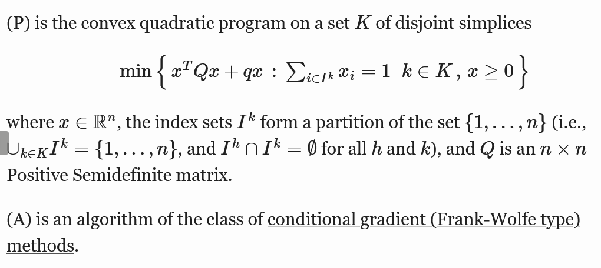

# Frank-Wolfe_for_CQP

This project is an implementation of the Frank-Wolfe algorithm for Box Constrained Quadratic Problems.



## Getting Started

1. Navigate to the `Frank-Wolfe_for_CQP` directory.
2. Install the required packages with the following command:
```bash
pip install -r requirements.txt
```

## Running the code

To run the code, use the following command:
```bash
python3 fw.py [-n/--dimensions DIMENSION_OF_THE_PROBLEM] [-r/--rank RANK_OF_THE_MATRIX]
 [-e/--eccentricity ECCENTRICITY_OF_THE_MATRIX] [-a/--active PERCENTAGE_OF_ACTIVE_CONSTRAINTS]
  [-i/--iterations MAX_NUMBER_OF_ITERATIONS] [-v/--verbose VERBOSITY_LEVEL] [-p/--plot] [--directory/-d DIRECTORY_PATH]
  [--pltrange/-pr PLOT_RANGE] [--onedge/-oe IF_PRESENT_START_ON_THE_EDGE] [--help/-h]
```
or 
```bash
python3 fw.py [-h/--help]
```
To get the help message.

## Running the tests

To run the tests, use the following command:
```bash
python3 tests.py
```
